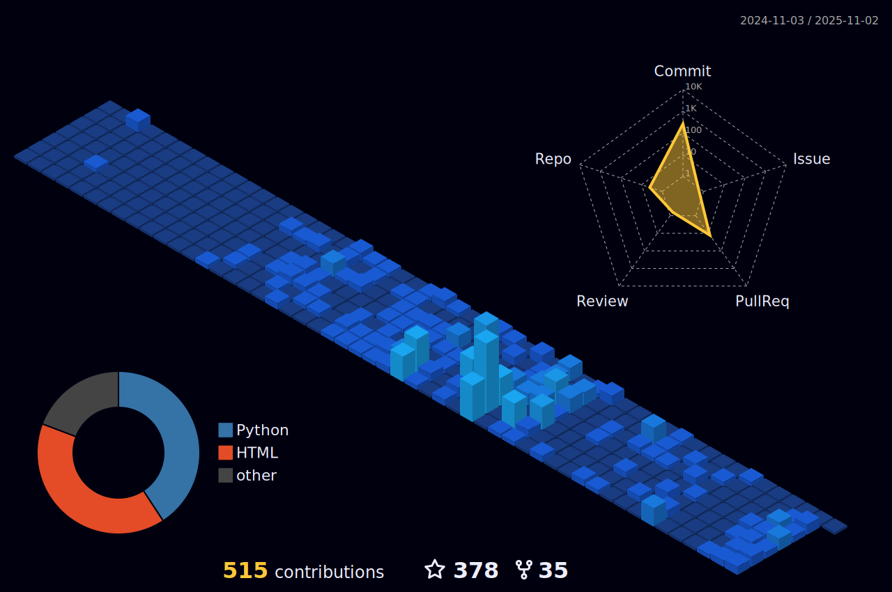

<table style="border-collapse: collapse; border: none;">
  <tr>
    <td width="50%">
    👋Hi, I'm a Ph.D. student at the Computational Linguistics Lab at Queen Mary University of London (QMUL), focusing on Multimodal Large Language Models (MLLMs). 

    🎯My research explores innovative ways to enhance interactions between language and Vision, aiming to advance the capabilities of AI in understanding and generating multimodal content.
    </td>
    <td width="50%">
      <picture>
        <source media="(prefers-color-scheme: dark)" srcset="./profile-3d-contrib/profile-night-view.svg" />
        <source media="(prefers-color-scheme: light)" srcset="./profile-3d-contrib/profile-south-season-animate.svg" />
        
        <!--  -->
      </picture>
    </td>

  </tr>
</table>
